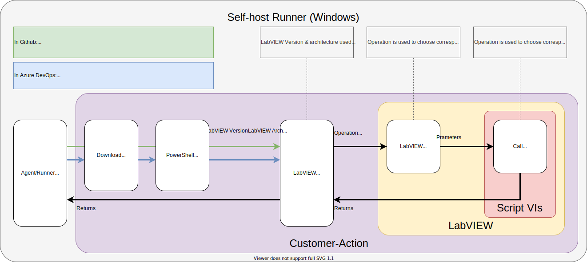
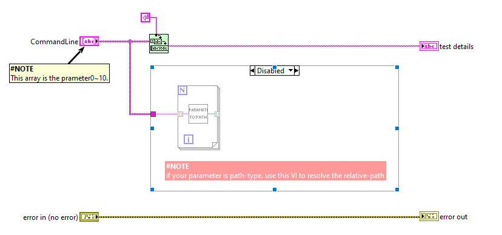

# How to Add A new Operation

Here is what happened after a self-hosted agent/runner receives a task.

1. Agent/Runner parse what actions needs to be done, in our case, `lvCICD` actions included in them.
2. The information including `LabVIEW Version` | `LabVIEW Architecture` | `Operation` | `Parameters` will be passed to LabVIEW CLI, through powershell script-call.
    1. In github, You can use customer-action like lvCICD@v0.2 in step. The specified tag of repo will be download implicitly. And lvCICD.ps1 will be called implicitly.
    2. In Azure DevOps, You need to explicitly download lvCICD tools with powershell scripts. And you need to use the tool explicitly in powershell scripts.
3. LabVIEW CLI start `lvCICD.vi` with specified LabVIEW. The `Operation VI` in script folder will be called in `lvCICD.vi`. Parameters are Passed to `Operation VI`.

## 1. Contribute to powershell scripts

Steps:

1. fork this repo
2. Save a new operation VI from VI template `"LabVIEW-Adapter\Scripts\_template.vit"`
    
    1. File Name is the operation name.
    2. `CommandLine` is the list of `Parameter0` .. `Parameter10` from workflow yml file.
    3. If the parameter is a path, use *"LabVIEW-Adapter\_support\parameter to Path_lvcicd.vi"* to resolve the relative path.
    4. `Test Detials` String and `error out` information will be published to log.
3. Start a pull request.

Thanks for your contribution.
